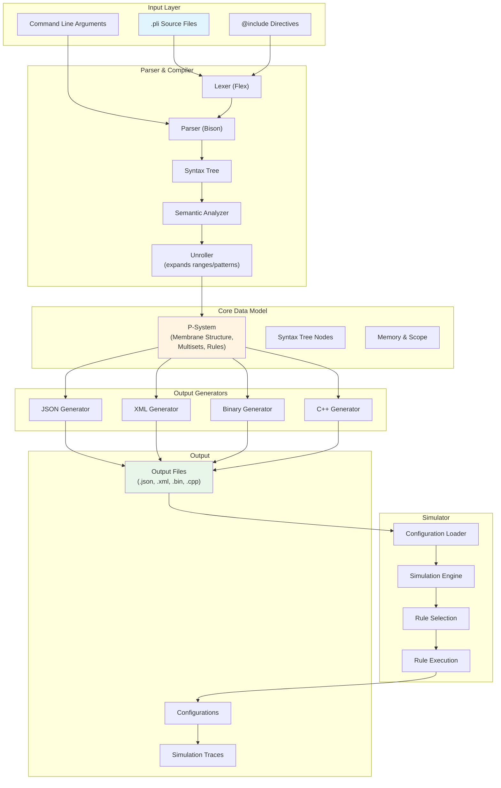
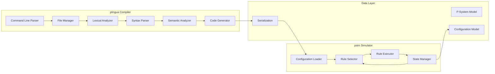
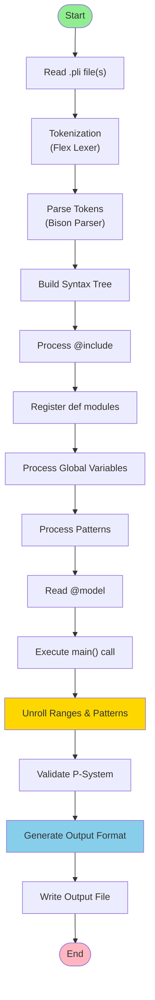
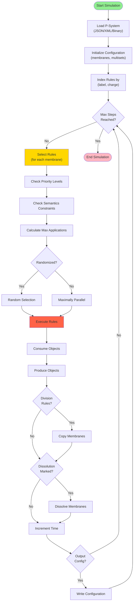
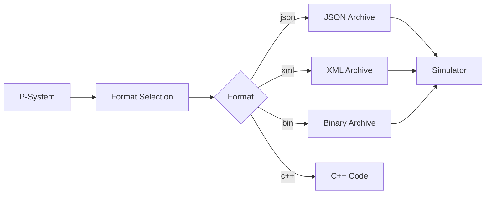

# P-Lingua Architecture Overview

## Executive Summary

P-Lingua is a comprehensive framework for Membrane Computing that provides:
- A domain-specific programming language (.pli files) for defining P-systems
- A compiler that transforms P-Lingua source code into multiple target formats
- A simulator that executes P-systems with configurable semantics
- Support for various membrane computing models (transition, division, dissolution, etc.)

## System Architecture



## Component Architecture



## Data Flow Architecture

### Compilation Flow



### Simulation Flow



## Technology Stack

### Core Technologies
- **Language**: C++11
- **Lexer**: Flex (Fast Lexical Analyzer)
- **Parser**: Bison (GNU Parser Generator)
- **Build System**: GNU Make
- **Serialization**: Cereal (with JSON, XML, Binary support)

### External Dependencies
- **Boost Filesystem**: File path management
- **Boost Program Options**: Command-line parsing
- **RapidJSON**: Fast JSON parsing (embedded via Cereal)
- **RapidXML**: XML parsing (embedded via Cereal)

### Supported Platforms
- Linux (tested on Ubuntu 16.04, 18.04, 20.04+)
- GCC 4.9.0+ (with C++11 and regex support)

## Module Breakdown

### 1. Parser Module (`src/parser/`)

**Purpose**: Transform .pli source code into an abstract syntax tree (AST)

**Components**:
- `plingua.l` - Lexical analyzer (Flex)
- `plingua.y` - Grammar definition (Bison)
- `parser.cpp/hpp` - Main parser controller
- `syntax_tree.cpp/hpp` - AST node definitions
- `node_value.cpp/hpp` - Node value types
- `scope.cpp/hpp` - Variable scope management
- `system.cpp` - System processing
- `pattern.cpp` - Pattern matching
- `init.cpp` - Initialization routines

**Key Responsibilities**:
- Tokenize input files
- Build syntax tree from tokens
- Resolve includes and imports
- Manage variable scopes
- Handle module definitions
- Unroll ranges and patterns
- Validate semantic correctness

### 2. P-System Data Model (`include/serialization.hpp`)

**Purpose**: Define the core data structures for P-systems

**Key Types**:
- `Value` - Generic value type (int, double, string)
- `Multiplicity` - Object multiplicity in multisets
- `ObjectString`, `LabelString`, `FeatureString` - Typed strings
- `Label` - Vector of label strings
- `Multiset` - Map of objects to multiplicities
- `Features` - Map of feature names to values
- `Membrane` - Hierarchical membrane structure
- `IMembrane` - Inner membrane (with multiset)
- `OMembrane` - Outer membrane (for rules)
- `Rule` - Evolution rule (LHR → RHR)
- `Psystem` - Complete P-system specification
- `Configuration` - Runtime configuration state
- `CMembrane` - Configuration membrane (runtime)

### 3. Simulator Module (`src/simulator/`)

**Purpose**: Execute P-systems according to their semantics

**Components**:
- `psim.cpp` - Simulator main program
- `simulator.hpp` - Simulation engine
- `command_line.cpp/hpp` - CLI argument parsing
- `shuffler.hpp` - Randomization support

**Key Algorithms**:
- **Rule Selection**: Maximal parallelism with priority
- **Rule Execution**: Two-phase (non-division, then division)
- **Membrane Dissolution**: Parent inherits children
- **Membrane Division**: Copy membrane structure
- **Semantics Checking**: Pattern-based constraints

### 4. Code Generators (`src/generators/`)

**Purpose**: Transform P-systems into various output formats

**Generators**:
- **JSON**: Human-readable, standard format
- **XML**: Structured markup format
- **Binary**: Compact, fast loading
- **Portable Binary**: Platform-independent binary
- **C++**: Generated simulation code

### 5. Serialization Layer (`include/cereal/`)

**Purpose**: Cross-format serialization and deserialization

**Features**:
- Template-based serialization
- Multiple archive formats (JSON, XML, Binary)
- Automatic type handling
- Versioning support

## Integration Points

### Input Integration
```mermaid
graph LR
    A[External Files] --> B[@include directive]
    B --> C[Parser]
    D[Command Line] --> E[Arguments]
    E --> C
    F[Global Variables] --> G[-g option]
    G --> C
```

### Output Integration


## Execution Modes

### 1. Compilation Mode (plingua)
```bash
plingua input.pli [args] -o output.json -f json -v 2
```
- Reads .pli source files
- Processes includes and patterns
- Generates output in specified format
- Can pass arguments to main()
- Can set global variables with -g

### 2. Simulation Mode (psim)
```bash
psim psystem.json -s 100 -o trace.json -v 1
```
- Loads compiled P-system
- Executes simulation steps
- Outputs configuration states
- Supports randomized execution
- Can load initial configuration

## Key Design Patterns

### 1. Singleton Pattern
- `Parser::getInstance()` - Global parser instance
- `Alphabet::getInstance()` - Global symbol table

### 2. Visitor Pattern
- Syntax tree traversal
- Node value computation
- Code generation

### 3. Strategy Pattern
- Output format selection
- Simulation semantics
- Rule selection strategies

### 4. Template Method Pattern
- Serialization framework
- Archive processing

### 5. Factory Pattern
- Node creation
- Value type creation

## Performance Considerations

### Compilation Performance
- Incremental file inclusion
- Lazy pattern expansion
- Efficient symbol table using maps

### Simulation Performance
- Rule indexing by (label, charge)
- Efficient multiset operations
- Minimal memory allocation during execution
- Optional randomization for non-determinism

## Security Considerations

1. **Input Validation**: Parser validates syntax and semantics
2. **Memory Safety**: C++ RAII and smart pointers
3. **Resource Limits**: No explicit bounds on recursion depth
4. **File Access**: Limited to include paths specified
5. **Type Safety**: Strong typing in data model

## Extension Points

### Adding New Output Formats
1. Implement format generator in `src/generators/`
2. Register format in `formats.cpp`
3. Update command-line options

### Adding New Semantics
1. Define pattern in model definition
2. Update rule matching logic
3. Implement constraints in simulator

### Adding New Language Features
1. Update lexer (`plingua.l`)
2. Update parser grammar (`plingua.y`)
3. Add AST node types
4. Implement semantic analysis
5. Update unroller

## Build and Deployment

### Build Process
```bash
make grammar    # Generate lexer/parser
make compiler   # Build plingua
make simulator  # Build psim
make all        # Build everything
sudo make install  # Install to /usr/local
```

### Installation Layout
```
/usr/local/PLingua/
├── plingua/
│   └── plingua (compiler binary)
├── psim/
│   └── psim (simulator binary)
└── LICENSE

/usr/local/bin/
├── plingua -> /usr/local/PLingua/plingua/plingua
└── psim -> /usr/local/PLingua/psim/psim

/usr/local/include/
├── cereal/ (serialization library)
└── plingua/
    └── serialization.* (public headers)
```

## Future Enhancements

1. **Language Features**
   - More complex pattern matching
   - Nested pattern definitions
   - Lambda expressions
   - Type inference

2. **Simulator Features**
   - Parallel simulation
   - GPU acceleration
   - Distributed simulation
   - Interactive debugging

3. **Tooling**
   - IDE integration
   - Syntax highlighting
   - Visual debugger
   - Profiler

4. **Documentation**
   - API documentation (Doxygen)
   - Tutorial system
   - Video guides
   - Interactive playground

## Related Resources

- **Main Repository**: https://github.com/RGNC/plingua
- **Membrane Computing**: http://ppage.psystems.eu/
- **Research Group**: http://www.gcn.us.es/
- **Documentation**: See `docs/` directory
- **Examples**: See `examples/` directory

## Glossary

- **P-System**: A computational model based on biological membranes
- **Membrane**: A compartment containing objects and potentially other membranes
- **Multiset**: A collection of objects with multiplicities
- **Rule**: A transformation pattern (left-hand side → right-hand side)
- **Configuration**: The current state of a P-system during simulation
- **Semantics**: Constraints on rule application (e.g., maximally parallel)
- **Label**: A hierarchical identifier for membranes
- **Charge**: An electrical state of a membrane (-, 0, +)
- **Pattern**: A template rule that can be instantiated multiple times
